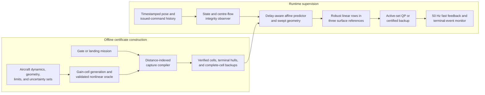

<h1 align="center">Moewe</h1>

<p align="center">
  <strong>Joint-Flow Capture Governor for robust terminal control of unpowered fixed-wing robots</strong>
</p>

<p align="center">
  <sub>Archived research implementation for dependency-preserving local-flow prediction,</sub><br>
  <sub>distance-indexed terminal capture, full-airframe geometry, and delay-aware control supervision.</sub>
</p>

<p align="center">
  <picture>
    <source media="(prefers-color-scheme: dark)" srcset="https://img.shields.io/badge/Status-Archived_Research_Project-b8b8b8?style=for-the-badge&labelColor=0d1117">
    <source media="(prefers-color-scheme: light)" srcset="https://img.shields.io/badge/Status-Archived_Research_Project-555555?style=for-the-badge&labelColor=ffffff">
    
  </picture>
  <picture>
    <source media="(prefers-color-scheme: dark)" srcset="https://img.shields.io/badge/Python-3.12-FFE873?style=for-the-badge&labelColor=0d1117">
    <source media="(prefers-color-scheme: light)" srcset="https://img.shields.io/badge/Python-3.12-306998?style=for-the-badge&labelColor=ffffff">
    
  </picture>
</p>

> [!IMPORTANT]
> **Archived research project.** Active development is paused. This repository is retained as a research snapshot for inspection, traceability, and future continuation. It is not a maintained library, a flight-ready controller, or an aviation safety product. No compatibility, support, or deployment guarantee is provided.

## About

Moewe is the research implementation accompanying the manuscript *Joint-Flow Capture Governor for Robust Terminal Control of Unpowered Fixed-Wing Robots*. It studies the final part of an approach, where an unpowered aircraft has limited recovery distance, control action may start late, local airflow can differ across the airframe, and success depends on the geometry and velocity of a complete-aircraft gate crossing or first permitted landing contact.

The method is called the **Joint-Flow Capture Governor (JFCG)**. It is a two-rate supervisory controller: a nominal controller proposes aileron, elevator, and rudder references, while JFCG changes those three references only when required by a precomputed robust capture certificate.

The central idea is to preserve physically shared flow uncertainty. At aerodynamic element \(i\), the local body-frame flow is represented as

\[
\lambda_i = c + Gq_i + \epsilon_i ,
\]

where:

- \(c\) is the flow at the aircraft reference point;
- \(G\) is a local spatial-gradient matrix;
- \(q_i\) is the body-frame element location; and
- \(\epsilon_i\) is an independent bounded remainder for variation not represented by the affine field.

The three centre-flow factors and nine gradient factors are shared by every aerodynamic element. Only the strip remainders are independent. This prevents the verifier from selecting mutually incompatible centre-flow or gradient values at different parts of the aircraft.

The implementation separates expensive offline verification from a small deterministic runtime problem. Online control has three decision variables regardless of the state, geometry, or uncertainty order.

---

## Workflow at a Glance

- **A bounded observer interface.** Timestamped pose and issued-command history feed an augmented motion-based observer. The covariance tunes its correction, but the deterministic guarantee comes from a separately calibrated state-and-centre-flow integrity set. Invalid innovation, cadence, latency, initialization, or containment produces no certified estimate.

- **Aircraft-scale joint-flow uncertainty.** The runtime centre-flow enclosure is combined with compiled spatial-gradient and strip-remainder bounds. Shared generators retain the dependence seen by the wing and tail instead of replacing every aerodynamic strip with an unrelated interval.

- **A verified aircraft core.** Aircraft dynamics, actuator limits, body/contact/footprint geometry, uncertainty bounds, and gain cells are compiled together. A candidate becomes a deployable `GeneratedAircraft` only after the nonlinear oracle accepts at least one gain cell and its declared state and geometry remainders.

- **Distance-indexed capture sets.** Terminal error is allowed to be larger when more correction distance remains. The compiler covers the accepted domain with verified tetrahedral cells, checks positive approach progress, and stores a reference that is feasible over each complete cell and command queue.

- **Complete-airframe terminal events.** Gate missions check swept occupied geometry through a finite aperture. Landing missions locate first permitted contact, reject earlier contact by forbidden body points, constrain the landing footprint, and bound contact-point velocities and touchdown attitude.

- **A three-reference online governor.** The affine predictor converts robust state, input, air-data, geometry, progress, and terminal-event conditions into linear inequalities in the three surface references. A deterministic active-set quadratic program selects the least-modified reference.

- **A pre-certified fallback.** After a valid current prediction, solver timeout or reported infeasibility selects the complete-cell backup. Stale estimates, invalid queues, failed lookup, out-of-envelope flow, row mismatch, or failed fast-sample containment instead produce no JFCG reference and require a separate flight-stack contingency.



---

## Timing Contract

The archived implementation uses the timing declared by the manuscript:

| Operation | Period or bound | Rate or interpretation |
|---|---:|---|
| Motion observer | `0.005 s` | 200 Hz |
| Fast feedback and prediction stage | `0.020 s` | 50 Hz |
| Reference governor | `0.100 s` | 10 Hz |
| Maximum command-onset delay | `0.140 s` | Inclusive delay envelope |
| Prediction/event horizon | `0.240 s` | 12 fast stages |

The horizon satisfies

\[
T_p \geq T_g + \bar{\tau}_c
\]

at equality. The `0.140 s` onset bound covers the reported maximum observed initial-response time of `0.137 s`. Post-onset actuator motion is represented by the actuator states and uncertain actuator time constants, rather than being counted a second time in the delayed-command queue.

---

## Offline and Runtime Method

### 1. Aircraft and uncertainty declaration

Each certificate is tied to one aircraft. The caller supplies:

- a 15-state stripwise fixed-wing model;
- physical surface limits and actuator dynamics;
- occupied-body, permitted-contact, and landing-footprint point sets;
- bounded centre flow, spatial gradient, and strip remainder;
- aerodynamic, mass-property, actuator, command, estimation, timing, and numerical uncertainty;
- a bounded compilation domain; and
- a gate or first-contact landing mission.

The numerical certificate is not transferable between aircraft. Reusing the method for another vehicle requires new dynamics, geometry, estimator calibration, uncertainty bounds, and verification.

### 2. Motion and centre-flow interface

The observer estimates the aircraft state and world-frame centre flow from raw pose and command history. It returns a containing zonotope only after integrity checks pass. The flow projection is advanced to governor time, enlarged for bounded temporal change and body-frame rotation over the prediction horizon, and required to remain inside the compiled flow envelope.

The observer is an input interface to JFCG, not the claimed methodological contribution. A rigid-body trajectory does not identify all nine instantaneous spatial-gradient entries, so the unresolved gradient remains a certified symmetric box.

### 3. Joint-flow factorization

The compiler stacks the centre and every strip flow into one zonotope. Its generator groups are:

1. three shared centre-flow factors;
2. nine shared, row-major gradient factors; and
3. three independent remainder factors per aerodynamic strip.

The same realization is propagated through aerodynamic forces and moments. Absence of flow knowledge is represented by wider sets, not by assuming zero flow.

### 4. Nonlinear verification and capture compilation

The offline oracle propagates intervals and affine forms with adaptive Picard enclosures. It checks continuous-time model-domain validity, strip-level aerodynamic validity, delayed command application, successor containment, swept-airframe geometry, progress, and terminal-event conditions.

The capture compiler constructs a distance-indexed family

\[
\mathcal C_m(d;\beta_m)
=
\{e:H_me\leq h_m+\beta_m d\},
\]

which equals the terminal target at \(d=0\). Accepted tetrahedral cells retain complete state fibers and command-delay queues. Each cell stores a feasible backup reference independent of successful online optimization; terminal cells additionally store an oracle-verified reference hull.

### 5. Runtime reference projection

At each governor update, the current prediction produces

\[
\mathcal U_k^{\mathrm{cap}}
=
\{\nu\in\mathbb R^3:A_k\nu\leq b_k\}.
\]

The governor solves a normalized three-variable quadratic program that balances deviation from the nominal reference against reference movement. Safety, progress, and terminal capture remain hard constraints, not objective penalties. Runtime code does not import the nonlinear oracle or SciPy optimization package.

---

## Guarantees and Boundaries

The manuscript establishes conditional recursive feasibility, pre-termination constraint satisfaction, and finite-time completion on the verified domain. Those conclusions require all of the following:

- the nonlinear oracle and generated predictor are sound;
- true state, flow, model, actuator, command, measurement, timing, and delay uncertainty remain inside their declared sets;
- the body, contact, footprint, and contact-velocity geometry conservatively contain the physical aircraft;
- initialization lies in an accepted capture cell with a valid issued-command queue; and
- observer, prediction, optimization, command issue, feedback, and handoff meet their timing contract.

The repository does **not** claim:

- global safety or a global viability kernel;
- route, trajectory, or approach selection;
- inference of an environmental flow map;
- validity outside the compiled uncertainty and state domains;
- structural-load or impact-load certification;
- minimum-time or minimum-energy control;
- post-contact stability, rebound prevention, or platform retention;
- processor-independent worst-case execution time; or
- transfer of one aircraft's numerical certificate to another aircraft.

The landing guarantee ends at first permitted contact. A separate flight-stack contingency is required whenever JFCG reports that the current execution has left the certified envelope.

---

## Repository Guide

| Path | Purpose |
|---|---|
| `models/aircraft.py` | Configurable stripwise fixed-wing dynamics and actuator model |
| `models/geometry.py` | Rigid-body occupancy, gate crossing, and first-contact landing geometry |
| `models/state.py` | State layout and constants |
| `models/updraft.py` | Compact updraft utility model used by simulations |
| `control/interval.py` | Directed interval, zonotope, and affine-form operations |
| `control/flow.py` | Dependency-preserving centre/gradient/remainder flow factorization |
| `control/uncertainty.py` | Timing constants and certificate uncertainty contract |
| `control/observer.py` | Motion-based state and centre-flow integrity interface |
| `control/predictor.py` | Generated aircraft core and preallocated affine runtime predictor |
| `control/oracle.py` | Offline validated nonlinear propagation and cell verification |
| `control/capture.py` | Distance-indexed capture compilation and lookup |
| `control/governor.py` | Deterministic three-variable active-set governor |
| `control/missions.py` | Gate, landing, free-space, and terminal support constraints |
| `simulation/` | Arena, launch, gate, and platform event adapters |
| `tests/` | Unit, soundness, integration, determinism, and runtime-isolation tests |

The repository is deliberately a research codebase rather than an installed Python package. Imports assume that commands are run from the repository root.

---

## Setup and Reproducibility

### Archived test environment

| Package | Last verified version |
|---|---:|
| Python | 3.12.11 |
| NumPy | 2.2.6 |
| SciPy | 1.16.3 |
| pytest | 9.0.3 |

SciPy is used by offline capture compilation and as an independent comparison in tests. The deployment governor is implemented without SciPy.

### Clone

```powershell
git clone https://github.com/GH-X-ST/Moewe.git
cd Moewe
```

### Local environment

This archive does not include a package manifest or lock file. To reproduce the last tested environment:

```powershell
py -3.12 -m venv .venv
.\.venv\Scripts\python.exe -m pip install --upgrade pip
.\.venv\Scripts\python.exe -m pip install numpy==2.2.6 scipy==1.16.3 pytest==9.0.3
```

### Test

Run the suite from the repository root:

```powershell
.\.venv\Scripts\python.exe -m pytest -q
```

The archived tree was last checked on Python 3.12.11 with:

```text
126 passed, 1056 subtests passed
```

The tests cover the mathematical and software contracts of the implementation. Passing them does not calibrate the uncertainty sets, validate physical geometry, create a mission certificate, or demonstrate flight safety.

### Entry points

There is no stable command-line interface or bundled production configuration. The tests are the executable examples for constructing:

- `RigidBodyGeometry`;
- `FlowBounds` and `Bounds`;
- `ObserverCalibration`;
- `GateMission` or `LandingMission`;
- a verified `GeneratedAircraft`;
- capture certificates; and
- `JointFlowCaptureGovernor`.

Production use would additionally require measured aircraft data, conservative geometry, calibrated integrity and uncertainty bounds, a compiled mission certificate, and target-computer timing evidence.

---

## Reproducibility Boundary

This repository archives the method implementation and its software verification tests. It does not currently bundle:

- simulation campaign logs;
- hardware or flight-test data;
- held-out observer-containment calibration;
- independent local-flow reference measurements;
- baseline or ablation results;
- a frozen production aircraft/mission certificate;
- target-computer timing distributions; or
- a completed experimental evaluation.

Numerical geometry and uncertainty values appearing in tests are fixtures for exercising the contracts unless separately supported by experimental evidence. They should not be presented as a physically certified Nausicaa deployment configuration.

Related experimental context is available in the [Nausicaa repository](https://github.com/GH-X-ST/Nausicaa) and [public thesis site](https://gh-x-st.github.io/Nausicaa-Thesis/).

---

## Citation

The associated manuscript is still a draft and this software snapshot has no DOI or final archival bibliographic record. When citing the project before a formal release, identify:

- the repository: `https://github.com/GH-X-ST/Moewe`;
- the exact Git commit;
- the access date; and
- the draft title: *Joint-Flow Capture Governor for Robust Terminal Control of Unpowered Fixed-Wing Robots*.

Replace this provisional reference with the published manuscript or software archive record when one becomes available.

## License

No license file is included in this repository. Do not assume that public availability grants permission to copy, modify, redistribute, or use the software in operational systems. Add an explicit license before any future software release.
